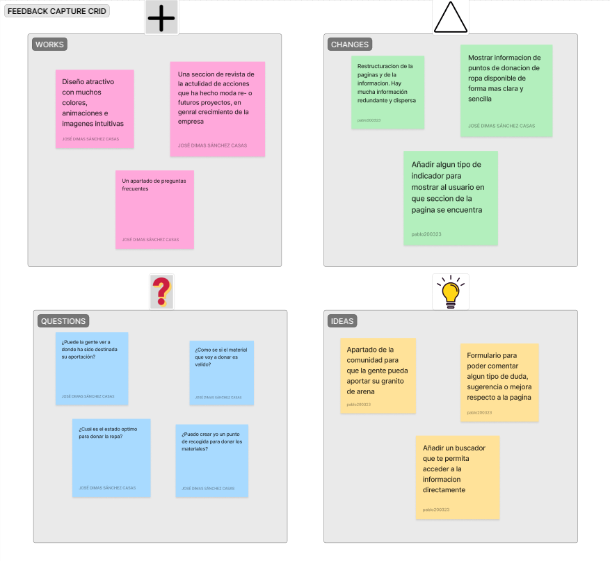
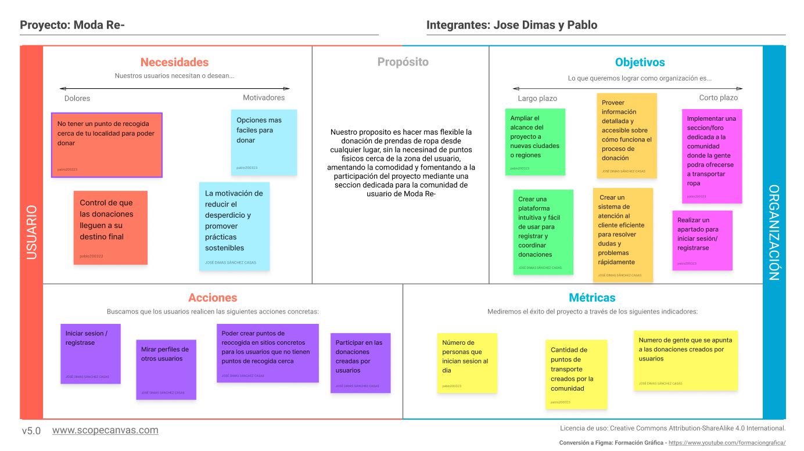
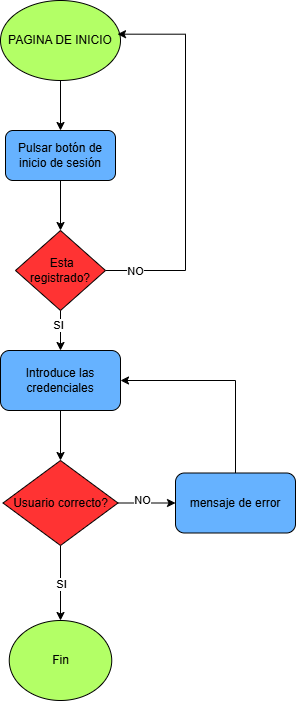
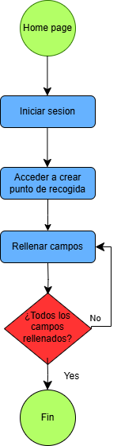
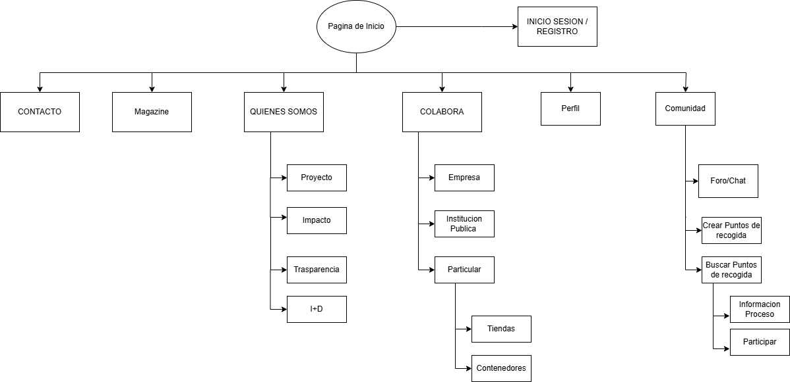
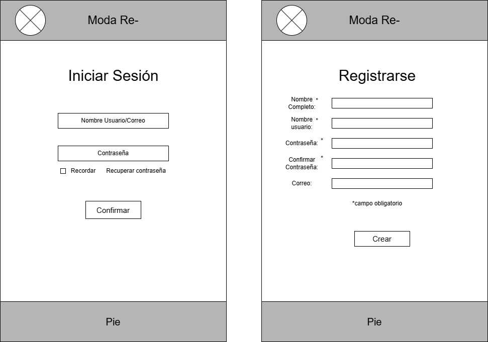
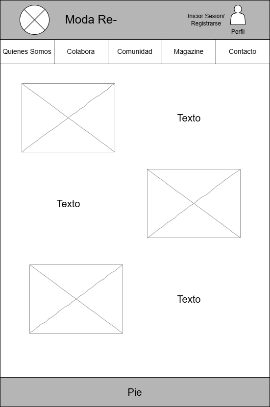
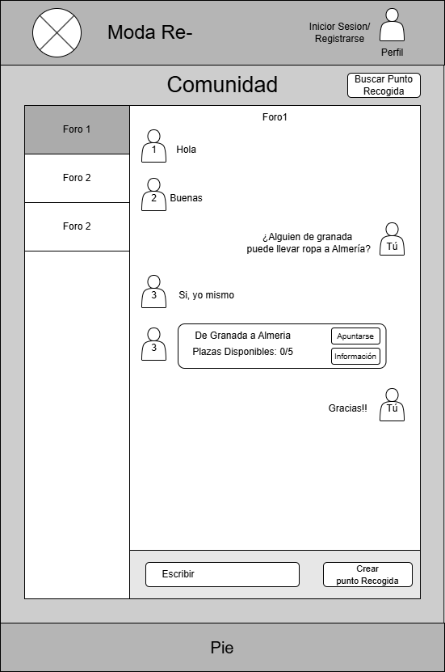

## DIU - Practica2, entregables

## Paso 2. UX Design  

### 2.a Reframing / IDEACION: Feedback Capture Grid / EMpathy map 
----
Hemos hecho el Feedback capture grid con las ideas que queriamos para nuestro proyecto, quedando de la siguiente manera:  
 
 

### 2.b ScopeCanvas
----

 

### 2.b Tasks analysis 
-----
En nuestra matriz de tareas de usuario, hemos recopilado las funciones de nuestra web y como de relevante serian para cada tipo de usuario, hemos añadido tres tipos de usuarios, dando las prioridades de alta(H), media(M) y baja(L):   

| User Groups                          | Donantes | Transportistas | Administradores |
|--------------------------------------|----------|----------------|-----------------|
| Iniciar sesión / registrarse         | H        | H              | H               |
| Crear puntos de recogida             | M        | H              |                 |
| Buscar puntos de recolección cercanos| H        | M              |                 |
| Participar en donaciones             | H        | L              |                 |
| Donación entregada correctamente     | H        | H              | L               |
| Mirar perfiles de otros usuarios     | H        | M              | M               |
| Usar foro / comunidad                | M        | H              | L               |
| Acceder a información del proceso    | H        | M              | H               |
| Resolver dudas con soporte           |          |                | H               |

 
Y hemos mostrado el flujo de tres tareas que consideramos las mas importantes:  

### Flujo Inicio de Sesión
  
### Flujo Crear Punto de Recogida
  
### Flujo Participar Donación
  

### 2.c IA: Sitemap + Labelling 
----

Nuestro sitemap para la navegacion de la nueva pagina de ModaRe- seria el siguiente:  

 
  

| Etiqueta                | Info                                                   | Icono      |
|-------------------------|--------------------------------------------------------|------------|
| Página de Inicio        | Página principal del sitio web                         | 🏠         |
| CONTACTO                | Sección para contactar con la organización             | 📞         |
| Magazine                | Publicaciones y artículos sobre la temática            | 📖         |
| QUIENES SOMOS           | Información sobre la organización y su misión          | ℹ️         |
| Proyecto                | Descripción del proyecto principal                     | 📌         |
| Impacto                 | Datos y métricas sobre el impacto del proyecto         | 📊         |
| Transparencia           | Información sobre transparencia y gestión de recursos  | 🏛️         |
| I+D                     | Investigación y desarrollo relacionados                | 🔬         |
| COLABORA                | Sección para colaborar con la organización             | 🤝         |
| Empresa                 | Cómo pueden colaborar las empresas                     | 🏢         |
| Institución Pública     | Participación de entidades gubernamentales             | 🏛️         |
| Particular              | Opciones de colaboración para particulares             | 👤         |
| Tiendas                 | Tiendas que participan en la iniciativa                | 🛒         |
| Contenedores            | Información sobre puntos de recogida                   | 🚮         |
| INICIO SESIÓN / REGISTRO | Sección de autenticación de usuarios                  | 🔑         |
| Perfil                  | Información y gestión del perfil de usuario            | 👤         |
| Comunidad               | Espacio para interacción y colaboración entre usuarios | 💬         |
| Foro/Chat               | Plataforma para discusión e intercambio de información | 🗣️         |
| Crear Puntos de recogida | Opción para generar nuevos puntos de recogida         | ➕         |
| Buscar Puntos de recogida | Opción para localizar puntos de recogida existentes  | 🔍         |
| Información Proceso     | Detalles sobre el proceso de recogida y participación  | 📜         |
| Participar              | Formas en las que se puede participar                  | ✅         |

### 2.d Wireframes
-----
Para la creacion de los warframes se ha utilizado la extension drawio de google drive.

### Iniciar Sesion/Registrarse
  
### Home Page
  
### Comunidad
  
### Crear Punto Recogida
  

 
