## Paso 3. Mi UX-Case Study (diseño)

### 3.a Moodboard

-----

Hemos creado un moodboard que muestra nuestras ideas para rediseñar el estilo visual de la empresa Moda Re-.

 

### 3.b Landing Page
 
----
Nuestra landing page ofrece información sobre el proyecto, todo con un diseño claro y visual para que atraer a el publico que no se vayan rapido, sino que se interesen.

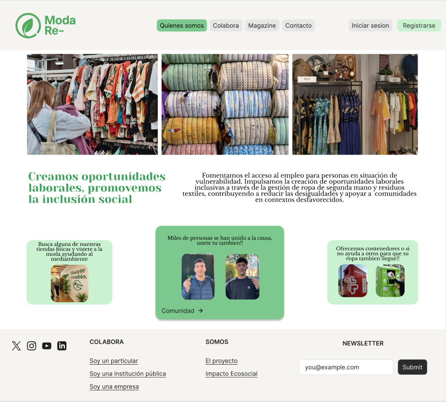 

### 3.c Guidelines
 
----

#   Patrón de diseño

Nuestro patrón de diseño está centrado en transmitir sostenibilidad, cercanía y claridad. Usamos un enfoque minimalista, con amplios espacios en blanco, componentes reutilizables y jerarquía visual clara.  
Los colores naturales se combinan con tipografías editoriales y una iconografía sencilla para lograr una experiencia accesible, estética y funcional.

La estética es **moderna y suave**, orientada a la participación comunitaria y a promover acciones conscientes. Se prioriza la accesibilidad, la navegación intuitiva y la coherencia visual entre pantallas.

#  Patrones de UI utilizados

- **Header fijo con navegación clara:** logotipo a la izquierda y segun si estas registrado o no te saldra -> tu avatar o dos botones para iniciar sesion / registarte.
- **Hero con eslogan + CTA:** imagen visual fuerte, texto motivador (*"Vístete de cambio"*) y llamada a la acción.
- **Tarjetas modulares:** para puntos de recogida, comunidad y testimonios, reutilizables y responsivas.
- **Mapa interactivo:** con pestañas por tipo de punto (tiendas, físicos...) y buscador de ciudades.
- **Chat de comunidad:** dividido por ciudades, con mensajes en tiempo real y botón para crear punto o unirse.
- **Diseño responsive:** versión móvil optimizada con menú hamburguesa, scroll limpio y navegación táctil fluida.

#  Patrones de UI utilizados
 Estos son los siguientes patrones que hemos utilizado:
  - Onboarding: Pagina principal de la pagina(Home page) que muestra el contenido de la pagina 'Quienes somos'.
  - Menu adaptado a movil: Barra situada en la parte inferior de la pagina para que sea mas accesible para movil. Permite acceder a las diferentes secciones de la pagina(Quienes somos, Colabora, Magazine...)
  - Hero image + Carousel: Carousel para mostrar distintas imagenes que utilizamos en la pagina.
  - Wizards: El proceso de registro de nuevos usuarios está dividido en dos pantallas secuenciales: una para nombre y usuario, y otra para email y contraseña.
  - Article List: Listado vertical de artículos en la sección Magazine, donde se muestran eventos y noticias con miniaturas y titulos.
  - Cards items: Las cartas representan los distintos puntos de recogida creado por la comunidad.
  - Item details + actions: Muestra informacion como el origen, el destino, la fecha de la recogida y la gente que se ha apuntado. Hay dos tipo de acciones, una para ver informacion mas detallada sobre las localizaciones del origen y el destino y otra para apuntarse a ese evento si todavia queda hueco.
  - Reserva: En nuestro caso seria indicar que participas en el evento, lo que te guarda un hueco para poder donar ropa en ese punto en especifico.
  - Form Input: Formulario para crear un punto de recogida. Es necesario especificar la cantidad de personas que pueden participar, la fecha, lugar de recogida y el destino exacto de forma obligatoria y de forma opcional se podra añadir informacion adicional.
  - About: La sección Quiénes somos funciona también como una página “About” con contenido detallado sobre la misión, el impacto y el equipo detrás del proyecto.
Como patron extra hemos añadido un calendario para poder establecer la fecha en la que se va a realizar laa recogida.

#  Estilo de lenguaje

Utilizamos un tono cercano, positivo y motivador. Cada frase está diseñada para **inspirar acción, generar confianza** y hacer sentir al usuario parte de un cambio mayor.

- Se habla en **plural inclusivo**: “Transformamos la moda”, “Buscamos facilitar”.
- Se evita el tecnicismo y se usan frases cortas y claras.
- Los llamados a la acción son **empáticos y proactivos**: “Únete”, “Dona”, “Apoya a otros”.

 Nestro eslogan: **“Vístete de cambio.”** 

 Este sería nuestro diseño:

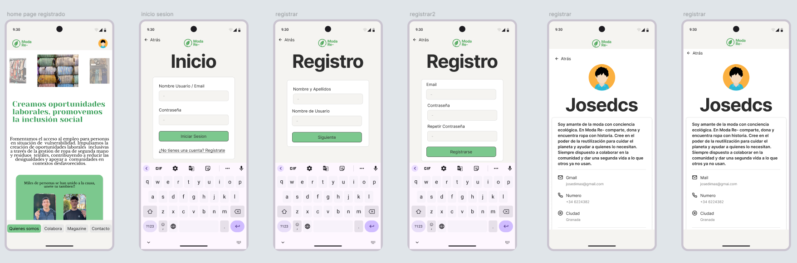 
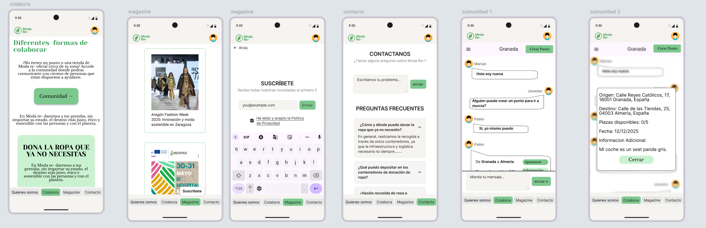 
 

### 3.d Mockup
 
----

[Layout Figma](https://www.figma.com/proto/ZWVUqUmODXvOtLuPGbMfHx/DIU_Toolkit_Framework--beta-2025---Copy-?node-id=5523-3249&p=f&t=Av2wtH8wjZOJSmLY-1&scaling=min-zoom&content-scaling=fixed&page-id=18%3A14661)
  Video demostracion:  
 

### 3.e ¿My UX-Case Study?
 

Las siguientes imágenes resumen de manera breve nuestro UX-Case Study publicado en este mismo Readme de Github:   
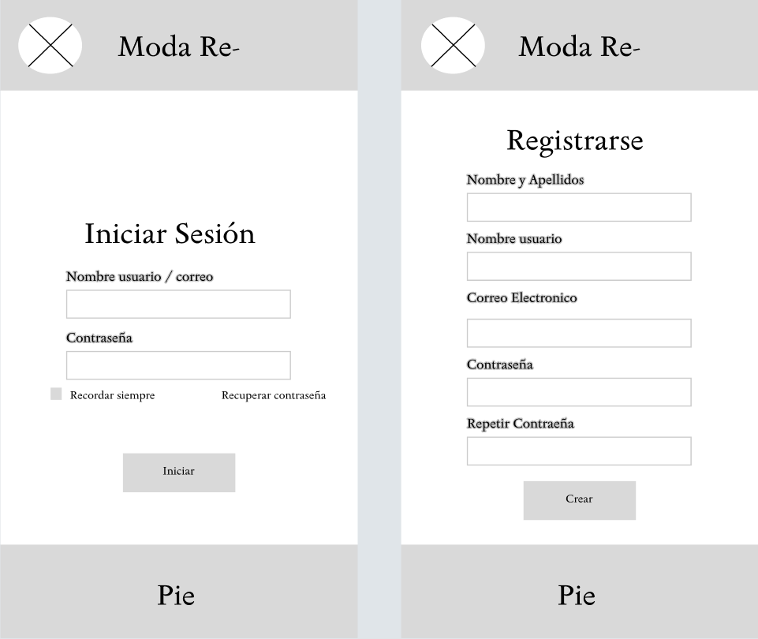  
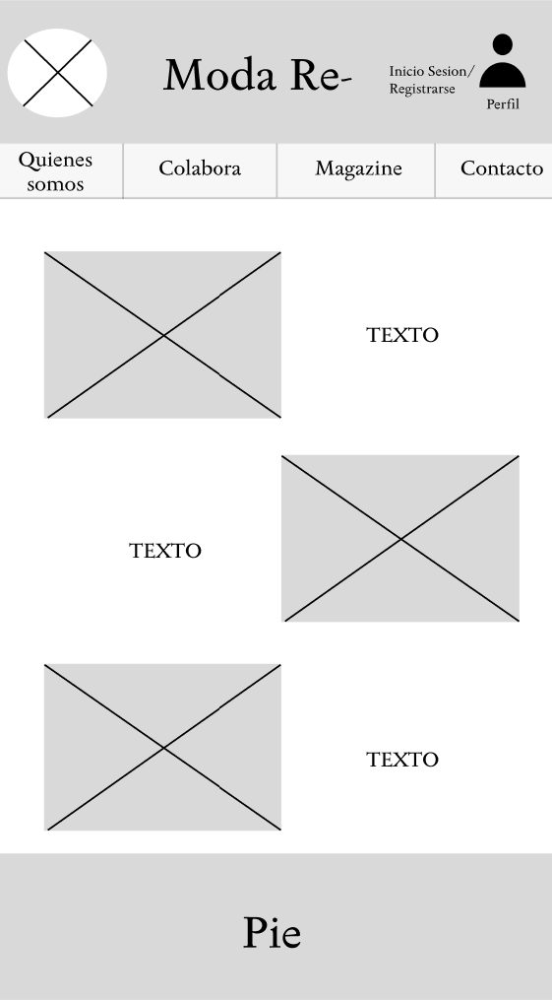  
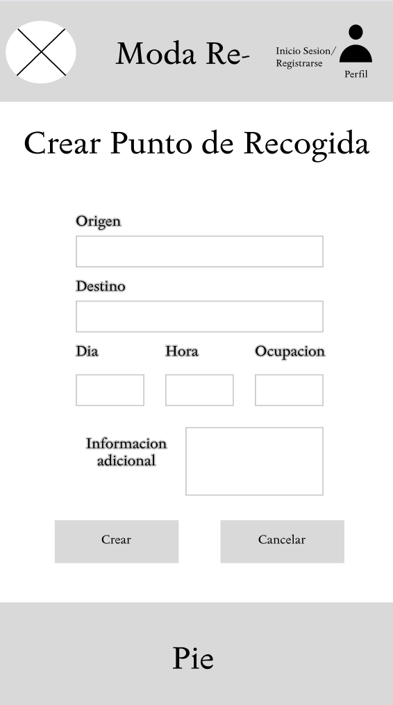  
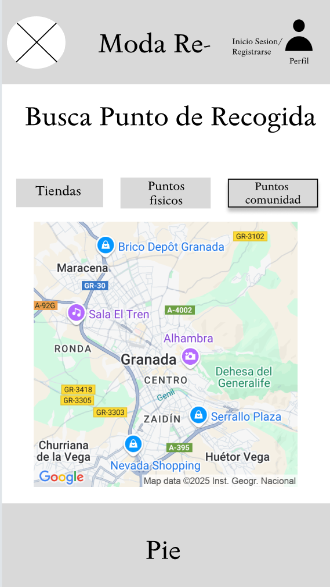  
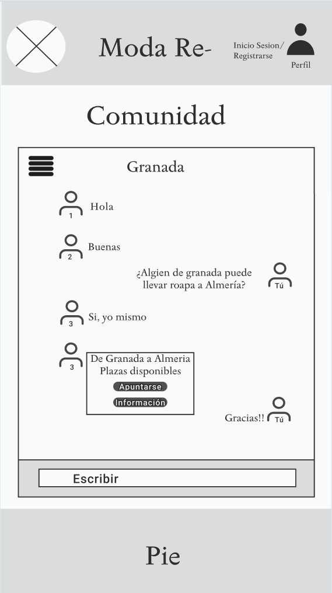  
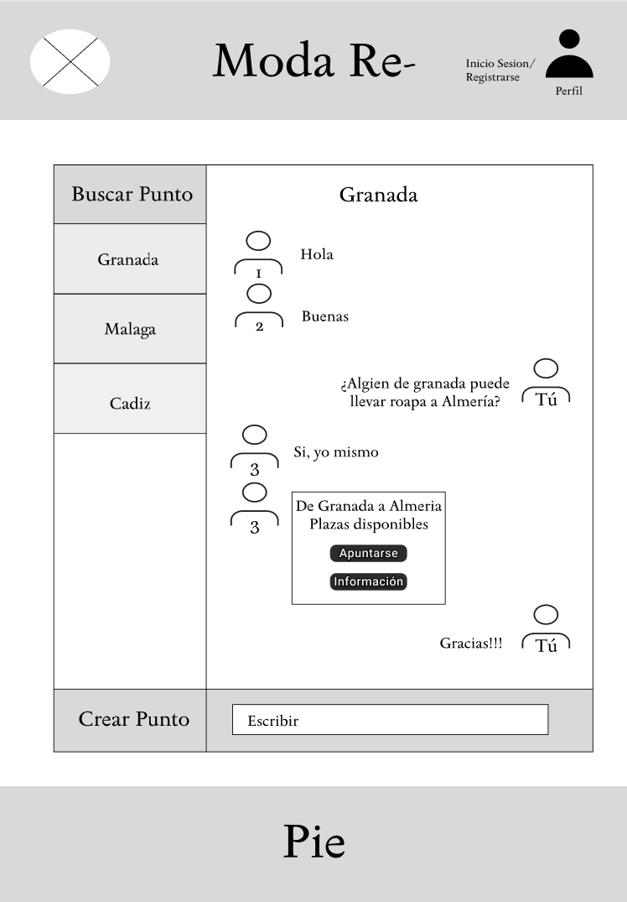  
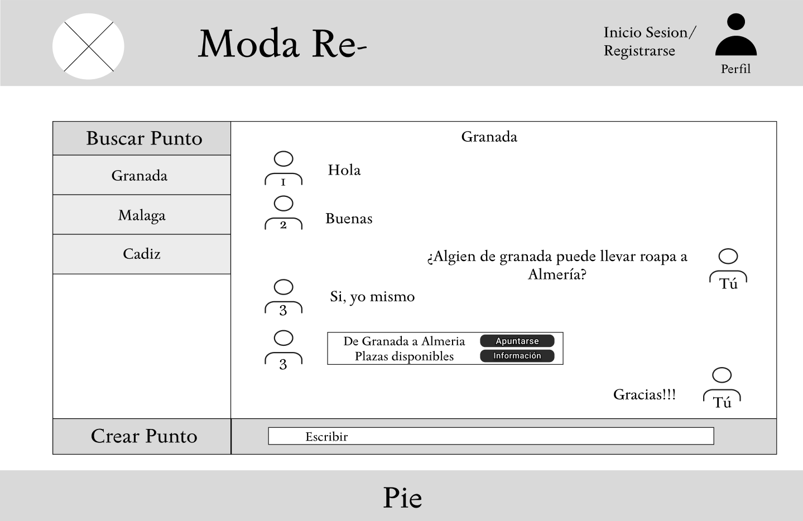  
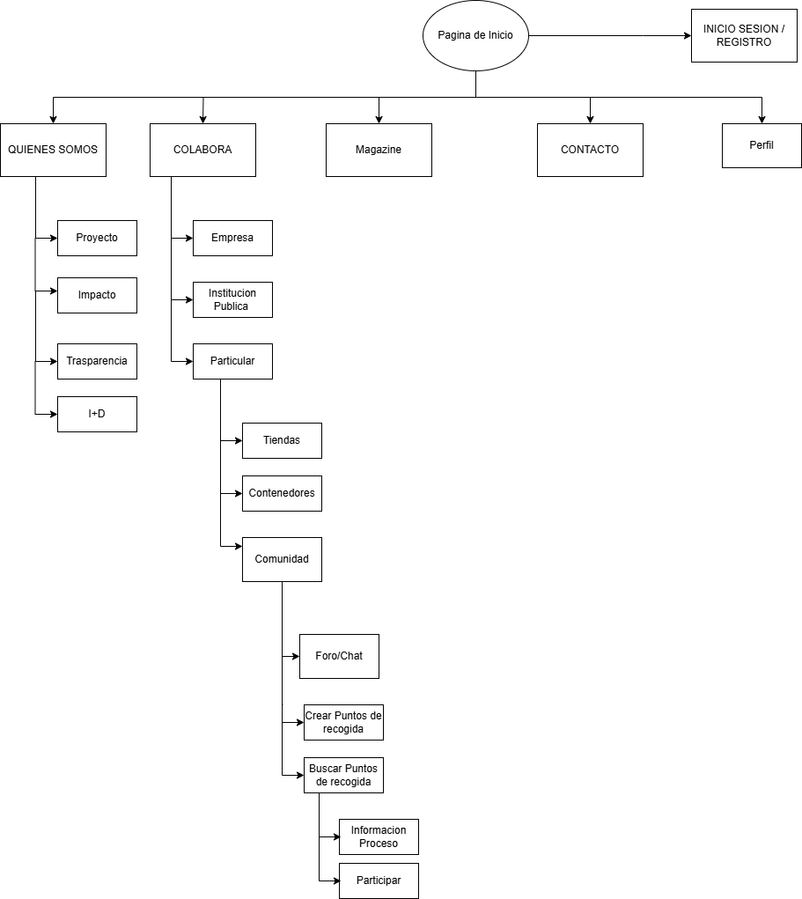 
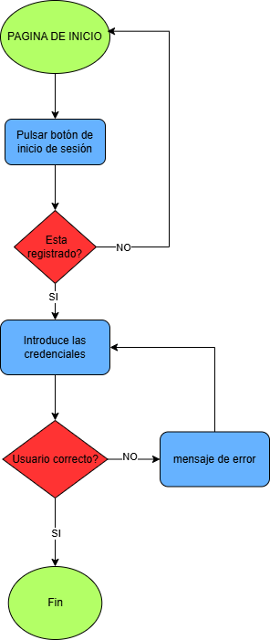  
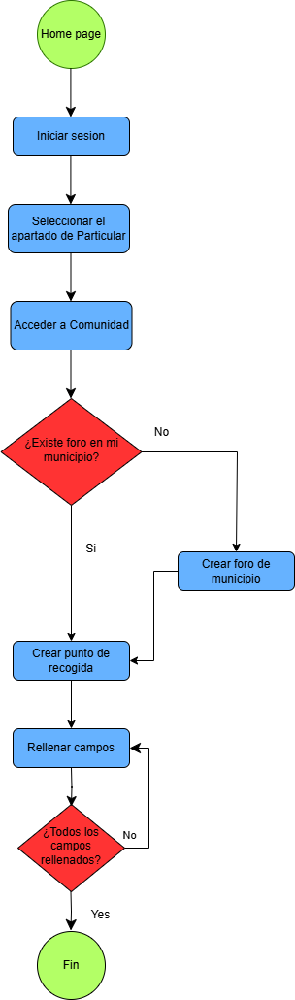  
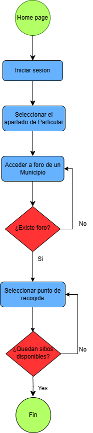  
 
 
 
 
 
