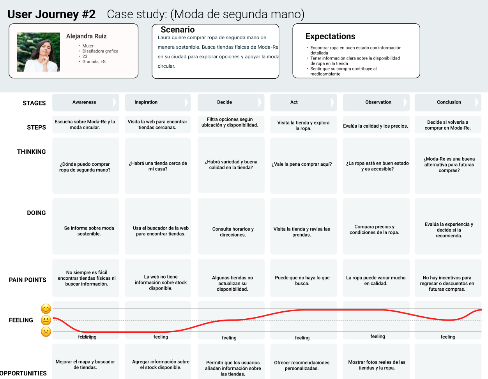

# DIU25
Prácticas Diseño Interfaces de Usuario (Tema: El ocio y comercio sostenible ) 

[Guiones de prácticas](GuionesPracticas/)

Grupo: DIU3_Duros.  Curso: 2024/25 

Actualizado: 03/03/2025

Proyecto: 

>>> Decida el nombre corto de su propuesta en la práctica 2 

Descripción: 

>>> Describa la idea de su producto en la práctica 2 

Logotipo: 

>>> Si diseña un logotipo para su producto en la práctica 3 pongalo aqui, a un tamaño adecuado. Si diseña un slogan añadalo aquí

Miembros:
DIU3-Duros
 * :bust_in_silhouette:  Pablo Rodríguez Cecilia     :octocat: https://github.com/pablo200323
 * :bust_in_silhouette:  Jose Dimas Sánchez Casas     :octocat: https://github.com/josedimas23 

----- 

# Proceso de Diseño 

 

## Paso 1. UX User & Desk Research & Analisis 

### 1.a User Reseach Plan
-----

Nuestro proyecto se centra en el análisis del ocio y el comercio sostenible, centrado en el reciclaje y la artesanía. Veremos cómo las personas interactúan con iniciativas que fomentan la reutilización de materiales, la producción artesanal y el consumo responsable, identificando sus motivaciones, barreras y expectativas. Para ello, investigaremos distintos tipos de usuarios, como consumidores comprometidos con la sostenibilidad, amantes de la moda y el arte o compradores económicos, consiguiendo así mejorar la experiencia del usuario, impulsarlos al uso de prácticas sostenibles y generar concienciación.

### Objetivos generales + KPI's o Métricas

| Objetivos | KPI's/Métricas|
|----------|-------|
|Aumentar la visibilidad de las  tiendas que colaboran  con nuestra causa|   - Número de visitas a la página de tiendas colaboradoras  - Aumento de interacciones en redes sociales relacionadas con las tiendas colaboradoras   |
|Conocer el numero de personas  interesadas en colaborar con el proyecto|   - Número de suscripciones a la newsletter  - Participación en encuestas o acciones de la empresa   |
|Incrementar el nivel de concienciación  medioambiental a la gente  que entra a la pagina web|   - Procentaje de usuarios que entran el pagina web y se salen sin interaccionar - Porcentaje de usuarios que visitan la sección de sostenibilidad/medioambiente  - Tiempo promedio en las páginas relacionadas con la sostenibilidad   |
|Medir el nivel de experiencia de los  usuarios mientras navegan  por la pagina web|   - Tiempo promedio de permanencia en la página  - Puntuación en encuestas de satisfacción de usuarios  - Tasa de clics en enlaces de navegación dentro de la web   |

### Información cualitativa y cuantitativa:

A continuacion definiremos los medodos par obtenerlos:

#### Información cualitativa:

   - Analisis etnografico: Nos sirve para observar como los usuarios interactuan y que es lo que buscan en la web para comprender sus comporrtamientos e intereses.
   - Entrevistas: Permiten obtener información mas concreta sobre las experiencias de los usuarios en la web, mediante preguntas para recopilar datos no numéricos, como opiniones, motivaciones, etc...
   - Pruebas de usabilidad: Sirven para evaluar la facilidad de uso de las funcionalidades de la web y obtener un feedback de ellas para saber posibles aspectos a mejorar.
     
#### Información cuantitativa:

   - Encuenta de satisfaccion: Realizaremos encuestas para poder observar el nivel de agrado de los usuarios mientras navegan por la pagina web, buscan un punto sostenible para donar ropa o encontran las tiendas disponibles mas cercanas.
   - Cuestionario: Se recopilara información a cerca de posibles aspectos a mejorar para hacer de la interaccion con la pagina una experencia mas agradable y libiana.
   - Analisis de metricas: Se mediran distintos parametros de la pagina web para observar como interaccionan los usuarios con ella, como la cantidad y el tipo de interacciones de los usuarios o el tiempo promedio que pasa un usuario en una pagina.  

### 1.b Competitive Analysis
-----
Hemos decidido de entre la opciones centrarnos en la moda de segunda mano con la pagina de "Moda-Re". Consideramos que hay mas asceptos de mejorar en esta pagina frente las otras, por lo que podremos detectar oportunidades de mejora y optimizar la accesibilidad y usabilidad de esta plataformas.

Como vamos a centrarnos en el tema de la moda de segunda mano, analizaremos "Moda-Re" frente a otras páginas web como "Zara" o "Humana", que son empresas grandes y están relacionadas con el medioambiente, el reciclaje y el comercio sostenible.
Aunque el tema principal de "Zara" no sea la ropa de segunda mano, es una empresa de moda muy concienciada con el reciclaje y las prácticas sostenibles, ya que, tiene un apartado de donación de ropa para proporcionar una segunda vida a esas prendas en centros sin animo de lucro. Por otro lado, en "Humana", el tema principal sí es la ropa de segunda mano, siendo muy parecida a lo que busca "Moda-Re".
 
Ahora hemos realizado un análisis para comparar los puntos fuertes de las tres páginas y detectar posibles áreas de mejora, tomando como referencia los aspectos positivos de las otras webs:

- https://modare.org/
- https://www.zara.com/es/
- https://www.humana-spain.org/

 

### 1.c Personas 
-----
Presentamos dos perfiles diferentes, donde cada uno aporta su visión y experiencia desde perspectivas diferentes, pero con el objetivo común. Ismael es un líder extrovertido y ordenado, apasionado por la moda, la tecnología y el impacto positivo en el medioambiente.  Alejandra por otro lado es una persona creativa y comprometida con el consumo responsable, el bienestar animal y la innovación tecnológica.
 
 
 

### 1.d User Journey Map
----
Ismael y Alejandra exploran el mundo del reciclaje y el comercio sostenible desde perspectivas diferentes. Para Ismael, la plataforma representa una oportunidad para entender mejor la sostenibilidad en el marketing, pero la falta de accesibilidad en la web dificulta su experiencia, especialmente al intentar colaborar. A pesar de esto, encuentra valor en la donación de ropa y su impacto positivo. Mientras, Alejandra busca tiendas físicas para comprar ropa de segunda mano de forma consciente. Aunque la web le ayuda a ubicar opciones cercanas, la falta de información sobre disponibilidad y calidad de los productos le genera dudas.
 
 
 

### 1.e Usability Review
----

La pagina de Mode Re- ha obtenido un 63 sobre 100 
  
 
  
En cuanto a las estetica, Moda Re- nos ofrece una pagina muy agradable a la vista, con colores y tonos pastel que hacen que leer el contenido de la pagina y acceder a sus funcionalidades sea agradable y placentero. Pero en cuando al diseño, la pagina tiene bastantes aspectos negativos a comentar que afectan a la calidad del contenido. Lo primero que se puede observar al entrar en algunas secciones de la pagina web es que contiene una mala estructuracion, tanto con el texto como con las imagenes, y es que muchas veces entremezclan el titulo de la pagina o de la sección con el parrafo que la explica haciendo que este sea difícil de leer o que lo ignores por completo. Otro problema que tiene la pagina es la redundancia de la información que intentan mostrar, ya que en varias de las secciones que tiene la pagina se repite la informacion del titulo en el siguiente parrafo, haciendo que no solo te canses de leer lo que te muestra y te vuelve más propenso a salirte de la página. Tras esto, vemos una clara incosistencia en el formato que tiene la pagina ya que no solo no utiliza las mismas fuentes para la estuctura de todos los titulos y parrafos del sitio, sino que en ocasiones te proporcionan un enlace para obtener mas información y otras no.

Tambien en la funcionalidad de busqueda de tiendas fisicas de Moda Re- o de puntos de recogida de ropa tiene bastantes problemas. No te indica que para buscar correctamente un punto en una ubicación concreta obligaroriamente tienes que indicar un codigo postal y una distancia minima de busqueda. En caso contrario no realiza ninguna busqueda y te muestra un mapa con todos los puntos disponibles, lo que puede llegar a saturar al usuario. Por otra parte, con o sin busqueda de sitio especifico, se muestra la información de los lugares disponibles en secciones poco estructuradas y con información redundante e innecesaria con un scroll vertical poco intuitivo.

Enlace: [Aqui](P1/Usability-review-Moda-Re.xlsx).

 

## Paso 2. UX Design  

>>> Cualquier título puede ser adaptado. Recuerda borrar estos comentarios del template en tu documento

### 2.a Reframing / IDEACION: Feedback Capture Grid / EMpathy map 
 
----

>>> Comenta con un diagrama los aspectos más destacados a modo de conclusion de la práctica anterior. De qué carece la competencia?? Tu diagrama puede ser una figura subida a la carpeta P2/

 Interesante | Críticas     
| ------------- | -------
  Preguntas | Nuevas ideas
  
    
>>> Explica el Problema y plantea una hipótesis. Es decir, explica aquí qué 
>>> se plantea como "propuesta de valor" para un nuevo diseño de aplicación propio

### 2.b ScopeCanvas

----

>>> Propuesta de valor, pero ahora en vez de un texto es un ScopeCanvas que has subido a P2/ y enlazado desde aqui. Tambien vale una imagen miniatura del recurso.
>>> No olvides que tu propuesta ya tiene un nombre corto y puedes actualizar la cabecera de este archivo

### 2.b User Flow (task) analysis 
 
-----

| User Groups | Donantes | Transportistas | Administradores |
|-------------|----------|----------------|-----------------|
|Iniciar sesión / registrarse	|H|H|H|
|Crear una donación	|M|H||
|Buscar puntos de recolección cercanos	|H|M||
|Crear puntos de recogida	|M|H||
|Participar en donaciones	|H|L||
|Mirar perfiles de otros usuarios|H|M|M|
|Usar foro / comunidad	|M|H|L|
|Acceder a información del proceso|H|M|H|
|Resolver dudas con soporte|||H|

>>> Definir "User Map" y "Task Flow" ... enlazar desde P2/ y describir brevemente

### 2.c IA: Sitemap + Labelling 
 
----

>>> Identificar términos para diálogo con usuario (evita el spanglish) y la arquitectura de la información. Es muy apropiado un diagrama tipo sitemap y una tabla que se ampliaría para llevar asociado la columna iconos (tanto para la web como para una app). 

Término | Significado     
| ------------- | -------
  Login  | acceder a plataforma

### 2.d Wireframes
 
-----

>>> Plantear el diseño del layout para Web/movil (organización y simulación). Describa la herramienta usada 

 

## Paso 3. Mi UX-Case Study (diseño)

>>> Cualquier título puede ser adaptado. Recuerda borrar estos comentarios del template en tu documento

### 3.a Moodboard

-----

>>> Diseño visual con una guía de estilos visual (moodboard) 
>>> Incluir Logotipo. Todos los recursos estarán subidos a la carpeta P3/
>>> Explique aqui la/s herramienta/s utilizada/s y el por qué de la resolución empleada. Reflexione ¿Se puede usar esta imagen como cabecera de Instagram, por ejemplo, o se necesitan otras?

### 3.b Landing Page
 
----

>>> Plantear el Landing Page del producto. Aplica estilos definidos en el moodboard

### 3.c Guidelines
 
----

>>> Estudio de Guidelines y explicación de los Patrones IU a usar 
>>> Es decir, tras documentarse, muestre las deciones tomadas sobre Patrones IU a usar para la fase siguiente de prototipado. 

### 3.d Mockup
 
----

>>> Consiste en tener un Layout en acción. Un Mockup es un prototipo HTML que permite simular tareas con estilo de IU seleccionado. Muy útil para compartir con stakeholders

### 3.e ¿My UX-Case Study?
 
-----

>>> Publicar my Case Study en Github... Es el momento de dejar este documento para que sea evaluado y calificado como parte de la práctica
>>> Documente bien la cabecera y asegurese que ha resumido los pasos realizados para el diseño de su producto

 

## Paso 4. Pruebas de Evaluación 

### 4.a Reclutamiento de usuarios 

-----

>>> Breve descripción del caso asignado (llamado Caso-B) con enlace al repositorio Github
>>> Tabla y asignación de personas ficticias (o reales) a las pruebas. Exprese las ideas de posibles situaciones conflictivas de esa persona en las propuestas evaluadas. Mínimo 4 usuarios: asigne 2 al Caso A y 2 al caso B.

| Usuarios | Sexo/Edad     | Ocupación   |  Exp.TIC    | Personalidad | Plataforma | Caso
| ------------- | -------- | ----------- | ----------- | -----------  | ---------- | ----
| User1's name  | H / 18   | Estudiante  | Media       | Introvertido | Web.       | A 
| User2's name  | H / 18   | Estudiante  | Media       | Timido       | Web        | A 
| User3's name  | M / 35   | Abogado     | Baja        | Emocional    | móvil      | B 
| User4's name  | H / 18   | Estudiante  | Media       | Racional     | Web        | B 

### 4.b Diseño de las pruebas 
 
-----

>>> Planifique qué pruebas se van a desarrollar. ¿En qué consisten? ¿Se hará uso del checklist de la P1?

### 4.c Cuestionario SUS
 
----

>>> Como uno de los test para la prueba A/B testing, usaremos el **Cuestionario SUS** que permite valorar la satisfacción de cada usuario con el diseño utilizado (casos A o B). Para calcular la valoración numérica y la etiqueta linguistica resultante usamos la [hoja de cálculo](https://github.com/mgea/DIU19/blob/master/Cuestionario%20SUS%20DIU.xlsx). Previamente conozca en qué consiste la escala SUS y cómo se interpretan sus resultados
http://usabilitygeek.com/how-to-use-the-system-usability-scale-sus-to-evaluate-the-usability-of-your-website/)
Para más información, consultar aquí sobre la [metodología SUS](https://cui.unige.ch/isi/icle-wiki/_media/ipm:test-suschapt.pdf)
>>> Adjuntar en la carpeta P4/ el excel resultante y describa aquí la valoración personal de los resultados 

### 4.d A/B Testing
 
-----

>>> Los resultados de un A/B testing con 3 pruebas y 2 casos o alternativas daría como resultado una tabla de 3 filas y 2 columnas, además de un resultado agregado global. Especifique con claridad el resultado: qué caso es más usable, A o B?

### 4.e Aplicación del método Eye Tracking 

----

>>> Indica cómo se diseña el experimento y se reclutan los usuarios. Explica la herramienta / uso de gazerecorder.com u otra similar. Aplíquese únicamente al caso B.

  
>>> Cambiar esta img por una de vuestro experimento. El recurso deberá estar subido a la carpeta P4/  

>>> gazerecorder en versión de pruebas puede estar limitada a 3 usuarios para generar mapa de calor (crédito > 0 para que funcione) 

### 4.f Usability Report de B
 
-----

>>> Añadir report de usabilidad para práctica B (la de los compañeros) aportando resultados y valoración de cada debilidad de usabilidad. 
>>> Enlazar aqui con el archivo subido a P4/ que indica qué equipo evalua a qué otro equipo.

>>> Complementad el Case Study en su Paso 4 con una Valoración personal del equipo sobre esta tarea

 

## Paso 5. Exportación y Documentación 

### 5.a Exportación a HTML/React
 
----

>>> Breve descripción de esta tarea. Las evidencias de este paso quedan subidas a P5/

### 5.b Documentación con Storybook

----

>>> Breve descripción de esta tarea. Las evidencias de este paso quedan subidas a P5/

 

## Conclusiones finales & Valoración de las prácticas

>>> Opinión FINAL del proceso de desarrollo de diseño siguiendo metodología UX y valoración (positiva /negativa) de los resultados obtenidos. ¿Qué se puede mejorar? Recuerda que este tipo de texto se debe eliminar del template que se os proporciona 

